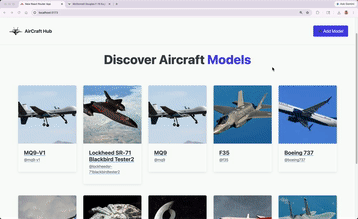

# WEB103 Prework - *👉🏿 Aircraft Studio*

Submitted by: **👉🏿 Minh Nguyen**

About this web app: **👉🏿 Allow users to see their favorite aircraft**

Time spent: **👉🏿 5** hours

## Required Features

The following **required** functionality is completed:

<!-- 👉🏿👉🏿👉🏿 Make sure to check off completed functionality below -->
- [x] **A logical component structure in React is used to create the frontend of the app**
- [x] **At least five content creators are displayed on the homepage of the app**
- [x] **Each content creator item includes their name, a link to their channel/page, and a short description of their content**
- [x] **API calls use the async/await design pattern via Axios or fetch()**
- [x] **Clicking on a content creator item takes the user to their details page, which includes their name, url, and description**
- [x] **Each content creator has their own unique URL**
- [x] **The user can edit a content creator to change their name, url, or description**
- [x] **The user can delete a content creator**
- [x] **The user can add a new content creator by entering a name, url, or description and then it is displayed on the homepage**

The following **optional** features are implemented:

- [x] Picocss is used to style HTML elements
- [x] The content creator items are displayed in a creative format, like cards instead of a list
- [x] An image of each content creator is shown on their content creator card

The following **additional** features are implemented:

* [ ] List anything else that you added to improve the site's functionality!

## Video Walkthrough

Here's a walkthrough of implemented required features:

👉🏿

<!-- Replace this with whatever GIF tool you used! -->
GIF created with ...  👉🏿 GIF tool here
<!-- Recommended tools:
[Kap](https://getkap.co/) for macOS
[ScreenToGif](https://www.screentogif.com/) for Windows
[peek](https://github.com/phw/peek) for Linux. -->

## Notes

Describe any challenges encountered while building the app or any additional context you'd like to add.

- The first challenge I encountered is to set up the project using Vite. There are several options like TypScript + ReacRouter, JS+ReacRouter, or ReacRouterV7 which I don't know what they are. So it took a bit of research to choose the one that I suitable for the project.

- The second challenge is to understand the project structure created by the template. The usage of root.tsx, routes.tsx, and welcome.tsx. I asked ChatGPT to help me understand those files and how to use them.

- The third challenge is to get familiar with modern React, which provides different hooks for different use cases such as useLocation, useAction, useLoaderData which are all new to me since I used React couple years ago.

- The final challeng is to generate the gif demo which took me almost an hour to get the software to work. I tried to use LiceCap on my Mac but it only recorded black screen. Then I setup Kap which worked perfectly.

## License

Copyright [👉🏿 yyyy] [👉🏿 name of copyright owner]

Licensed under the Apache License, Version 2.0 (the "License"); you may not use this file except in compliance with the License. You may obtain a copy of the License at

> http://www.apache.org/licenses/LICENSE-2.0

Unless required by applicable law or agreed to in writing, software distributed under the License is distributed on an "AS IS" BASIS, WITHOUT WARRANTIES OR CONDITIONS OF ANY KIND, either express or implied. See the License for the specific language governing permissions and limitations under the License.